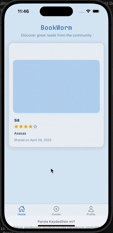

# Welcome to BookStore app 👋

This project is a mobile application designed for people who love reading books and want to share or receive book recommendations.
After signing up and logging in, users can view book recommendations from other users, upload a photo of a book they've read, rate it with stars, and add a description to share their own recommendation. Users can also delete their past recommendations if they wish.

## Used Technologies

### Backend

- Node.js
- Express.js
- Mongoose
- Cloudinary
- JSON Web Tokens (JWT)
- Bcrypt

### Frontend

- @expo/vector-icons
- @react-native-async-storage/async-storage
- @react-navigation/bottom-tabs
- @react-navigation/native
- expo
- expo-blur
- expo-constants
- expo-font
- expo-haptics
- expo-image
- expo-linking
- expo-router
- expo-splash-screen
- expo-status-bar
- expo-symbols
- expo-system-ui
- expo-web-browser
- react
- react-dom
- react-native
- react-native-gesture-handler
- react-native-reanimated
- react-native-safe-area-context
- react-native-screens
- react-native-web
- react-native-webview
- zustand
- expo-image-picker
- expo-file-system

## Screen

